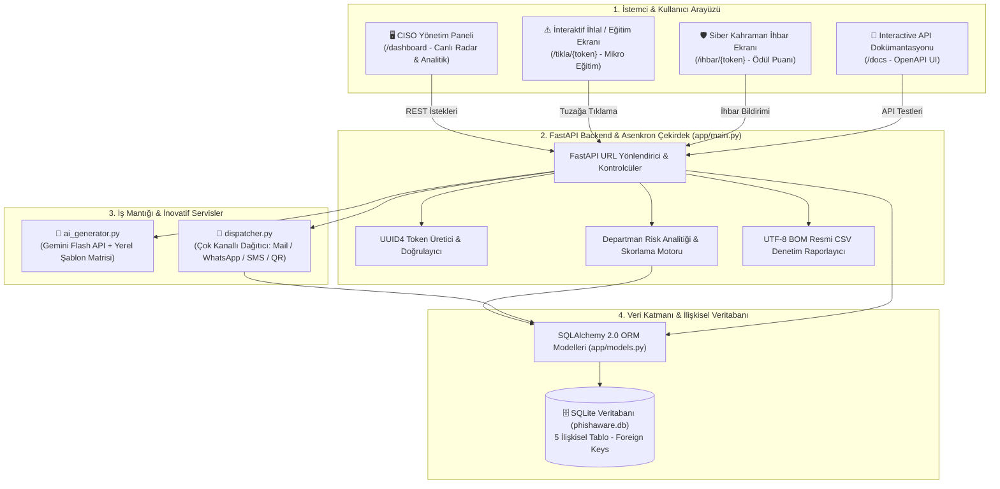
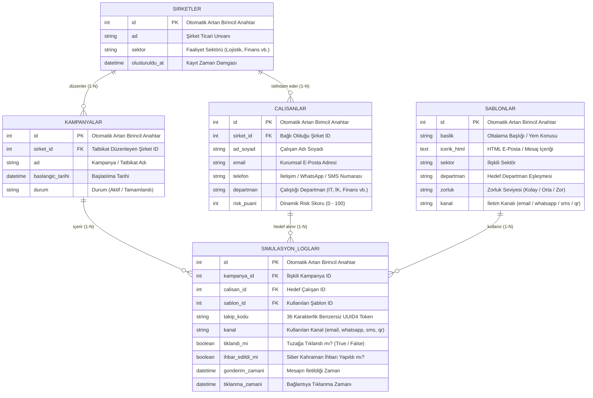

# 🛡️ PhishAware - Otonom Oltalama Simülasyonu ve Çalışan Güvenlik Farkındalık Platformu

[](https://www.python.org/)
[](https://fastapi.tiangolo.com/)
[](https://www.sqlite.org/)
[](https://opensource.org/licenses/MIT)
[](http://127.0.0.1:8000/dashboard)

**PhishAware**, modern kurumlarda insan kaynaklı siber güvenlik zaafiyetlerini proaktif olarak tespit etmek, çalışanların oltalama (phishing) farkındalığını ölçmek ve denetim raporları sunmak için geliştirilmiş yeni nesil **Full-Stack B2B SaaS oltalama simülasyon ve siber eğitim platformudur**.

---

## ⚡ Neden PhishAware?

Dünyadaki siber saldırıların **%91'inden fazlası** doğrudan sistem açıklarından değil, bir personelin dikkatsizliğinden kaynaklanmaktadır. PhishAware, klasik sıkıcı eğitim videoları yerine **"Siber Aşı" ve "Dijital Yangın Tatbikatı"** mantığıyla çalışır. Çalışanlara habersiz, güvenli ve kontrollü tuzaklar göndererek hata anında canlı farkındalık kazandırır.

### 🌟 Öne Çıkan Yetenekler

- **Çok Kanallı (Omnichannel) Tatbikat Desteği:**
  - ✉️ **E-Posta (Spear Phishing):** Departmana özel hazırlanmış maskelenmiş kurumsal e-postalar.
  - 💬 **WhatsApp & SMS (Smishing):** Mobil çalışanları hedefleyen fatura, kargo veya hesap doğrulama senaryoları.
  - 📱 **Dinamik QR Kod (Quishing):** Dinamik QR kodları ile fiziksel ve dijital tarama testleri.
- **Departman Bazlı Akıllı Yapay Zeka Eşleme (%20 YZ / %80 Mühendislik):**
  - Tek tıkla ister tüm şirkete, ister belirli bir birime (IT, İK, Finans, Satış vb.) uygun senaryolar atanır.
  - IT personeline SSH/yama uyarısı, İK personeline bordro/yan haklar, Finans birimine IBAN/fatura iptali senaryosu otomatik üretilir.
- **Benzersiz Güvenlik Takip Tokenları (UUID4):**
  - Her bir personele özel 36 karakterlik tekil takip kodları ile sıfır sahte pozitif (false-positive).
- **İnteraktif İhlal ve Anında Eğitim Ekranı (Landing Page):**
  - Tuzağa düşen personele virüs bulaşmaz; sakinleştirici, hatasını gösteren ve 3 kritik güvenlik ipucunu anlatan interaktif bir mikro eğitim sunulur.
- **Siber Kahraman (PhishAlert) İhbar Mekanizması:**
  - Oltalamayı fark edip bildiren çalışanlara pozitif ödül puanı verilir; risk puanları düşürülür.
- **Yönetici ve CISO Operasyon Masası:**
  - Canlı radar göstergeli neon siber dashboard, departman risk matrisi, Excel/CSV UTF-8 BOM denetim raporu indirme ve A4 baskı formatı.

---

## 🌐 Full-Stack Web Platformu ve İstek Akış Mimarisi

Sistem, modern asenkron web mimarisi üzerinde **FastAPI + SQLAlchemy + SQLite** üçlüsüyle çalışır:



---

## 🗄️ İlişkisel Veritabanı Mimarisi (Entity-Relationship Diyagramı)

PhishAware, verilerini SQLite üzerinde 5 adet ilişkisel tablo ile yönetir. Tüm tablolar yabancı anahtarlar (`Foreign Key`) ve basamaklı silme/güncelleme (`Cascade`) kurgusuyla birbirine bağlıdır:



---

## 🖥️ Web Portalları ve Endpoint'ler

Platform ayağa kalktığında tarayıcınızdan aşağıdaki web arayüzlerine erişebilirsiniz:

| URL / Endpoint | Web Bileşeni | Açıklama ve Özellikler |
| :--- | :--- | :--- |
| **[`/dashboard`](http://127.0.0.1:8000/dashboard)** | 🛡️ **Yönetim & Komuta Masası** | Canlı yanıp sönen radar rozeti, KPI kartları, departman risk çubukları, tek tıkla tatbikat başlatma formu, gerçek zamanlı siber terminal ve aktif hedef takip tablosu. |
| **[`/tikla/{token}`](http://127.0.0.1:8000/docs)** | ⚠️ **İhlal & Anında Eğitim Sayfası** | Oltalamaya tıklayan personele özel üretilen eğitim landing page'i. Hangi ipuçlarını kaçırdığını gösterir, virüs bulaştırmadan farkındalık aşılar. |
| **[`/ihbar/{token}`](http://127.0.0.1:8000/docs)** | 🏆 **Siber Kahraman (PhishAlert) Ekranı** | Şüpheli mesajı fark edip bildiren personele ödül tebriki sunar ve sistemdeki risk puanını 5 puan düşürür. |
| **[`/rapor/csv/{sirket_id}`](http://127.0.0.1:8000/rapor/csv/1)** | 📥 **Resmi Denetim Raporu İndirme** | KVKK ve ISO 27001 uyumlu, UTF-8 BOM destekli Excel uyumlu Türkçe CSV denetim raporu çıktısı. |
| **[`/docs`](http://127.0.0.1:8000/docs)** | 📑 **Interactive Swagger UI** | Tüm backend API rotalarının parametrelerini test edebileceğiniz interaktif dokümantasyon. |

---

## 📁 Proje Dosya Ağacı

```text
PhishAware/
├── app/
│   ├── __init__.py           # Paket tanımı
│   ├── database.py           # SQLAlchemy bağlantı motoru ve oturum yönetimi
│   ├── models.py             # 5 İlişkisel Tablo Modeli (ORM)
│   ├── schemas.py            # Pydantic v2 doğrulama ve veri aktarım nesneleri (DTO)
│   ├── ai_generator.py       # Google Gemini Flash API entegrasyonu & yerel senaryo motoru
│   ├── dispatcher.py         # Çok kanallı akıllı dağıtım motoru (E-posta/WhatsApp/SMS/QR)
│   └── main.py               # FastAPI çekirdeği, Analitik motoru ve Koyu Tema Web Portalı
├── seed_corporate_data.py    # 22 çalışanlı kurumsal TrendLojistik A.Ş. veri kurulum scripti
├── seed.py                   # Temel başlangıç test verisi yükleyici
├── baslat.bat                # Tek tıkla sunucuyu başlatıp dashboard'u tarayıcıda açan betik
├── requirements.txt          # Gerekli Python kütüphaneleri
├── .env.example              # Güvenli çevre değişkenleri şablonu (Sıfır gizli veri)
├── .gitignore                # Güvenlik, veritabanı ve gizlilik kuralları
├── LICENSE                   # MIT Açık Kaynak Lisansı
├── test_innovations.py       # Çok kanallı dağıtım, ihbar ve landing page test süiti
├── test_ai_dispatch.py       # Departman bazlı akıllı hedefleme test süiti
└── test_dispatcher.py        # E-posta ve dağıtım motoru doğrulama testi
```

---

## 🚀 Hızlı Kurulum ve Çalıştırma

### 1. Depoyu Klonlayın
```bash
git clone https://github.com/MertCinbar/PhishAware.git
cd PhishAware
```

### 2. Bağımlılıkları Yükleyin
```bash
pip install -r requirements.txt
```

### 3. Çevre Değişkenlerini Tanımlayın (İsteğe Bağlı)
```bash
cp .env.example .env
```
> *.env dosyasında `GEMINI_API_KEY` ve `SMTP_*` bilgilerini girebilirsiniz. Boş bırakırsanız sistem çevrimdışı kurumsal senaryolarla ve güvenli simülasyon kuyruğuyla tam işlevsel çalışır.*

### 4. Kurumsal Örnek Veritabanını Oluşturun
```bash
python seed_corporate_data.py
```
*(TrendLojistik A.Ş. bünyesinde 7 departmana dağılmış 22 gerçekçi personel veritabanına otomatik işlenir).*

### 5. Sunucuyu Başlatın
**Windows için tek tıkla:** `baslat.bat` dosyasına çift tıklayabilirsiniz.  
**Veya terminalden:**
```bash
python -m uvicorn app.main:app --reload --host 127.0.0.1 --port 8000
```

---

## 🔒 Güvenlik, Gizlilik ve Etik Beyan

- **Eğitim ve Savunma Amaçlıdır:** PhishAware, yalnızca yetkili kurumların kendi personeline yönelik farkındalık tatbikatları ve akademik araştırma amacıyla tasarlanmıştır.
- **İzin ve Yetkilendirme:** Sistem, hedef personelin açık rızası ve kurum yönetiminin yasal izni olmadan üçüncü şahıslara karşı kullanılamaz.
- **Kişisel Veri Gizliliği:** Depo içerisine hiçbir gerçek kimlik bilgisi, parola, token veya gizli anahtar dahil edilmemiştir. `.gitignore` ve `.env.example` standartlarına tam uyumludur.

---

## 📜 Lisans

Bu proje [MIT Lisansı](LICENSE) kapsamında lisanslanmıştır. Detaylar için `LICENSE` dosyasına bakabilirsiniz.

---

**Geliştirici:** [Mert Çinbar](https://github.com/MertCinbar)  
*Muğla Sıtkı Koçman Üniversitesi - Bilişim Sistemleri Mühendisliği*
